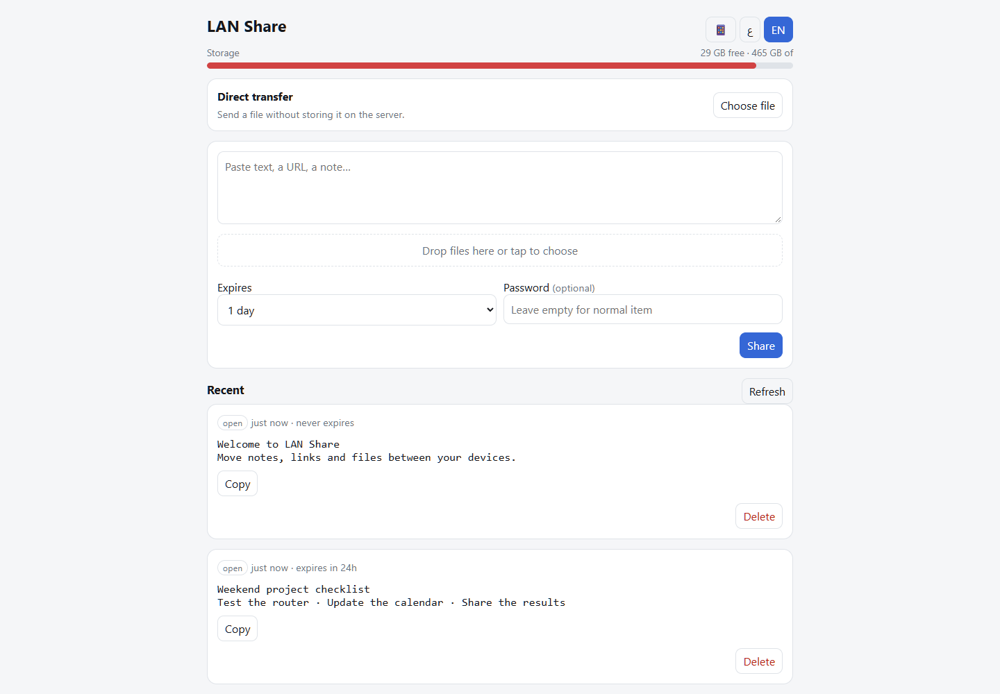

# LAN Share

**A small browser inbox for sharing text, links, and files across phones, Windows, and Linux on a local network.**

No accounts or native client are needed. The Arabic-first interface also supports English. A Python server, SQLite metadata, and nginx were chosen to fit alongside routing workloads on a small TX3 Mini.



## Two ways to share

| Mode | Path | Lifetime |
| --- | --- | --- |
| Stored share | Browser → server storage → receiver | Expiring or permanent; optional item password |
| Direct Send | Sender → bounded server queue → receiver | Temporary relay; receiver approval; lost on restart |

The direct relay uses eight 256 KiB queue slots: about 2 MiB of queued payload per transfer, plus process/socket/proxy overhead. It is server-relayed, not peer-to-peer. Disabling nginx request/response buffering is necessary to preserve the intended streaming behavior.

Other features include multiple attachments, QR receiving, progress/cancellation, a storage indicator, an installable PWA, and a Web Share Target endpoint. Individual stored files are limited to 8 GiB in the recovered implementation.

## Run locally

Python 3.11 or 3.12 uses only the standard library. Python 3.13+ also needs the `legacy-cgi` compatibility package because the original multipart parser imports `cgi`.

```sh
python -m venv .venv
# Activate .venv using your platform's activation command.
python -m pip install -r requirements.txt
python server.py
```

Open <http://127.0.0.1:8765/share/>. Runtime files go into ignored `data/`. The app binds loopback by default; use the [nginx and systemd setup](docs/self-hosting.md) for household access and HTTPS.

## Status

Source and static assets were recovered from the running service on 2026-10-02. The public copy adds configurable storage/port settings and local serving of the existing PWA assets. No stored shares, uploads, signing keys, passwords, or private hostnames are included. The live service was not modified.

[Architecture](docs/architecture.md) · [Self-hosting](docs/self-hosting.md) · [API](docs/api.md) · [Known limitations](docs/limitations.md) · [Security model](SECURITY.md) · [Credits](NOTICE.md)
