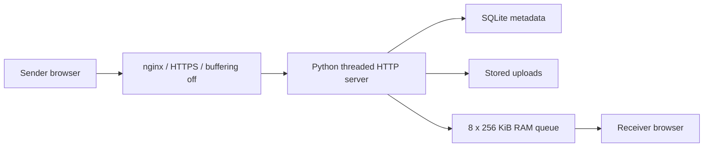

# Architecture

`server.py` contains the HTTP handlers and embedded bilingual interface. `static/` contains PWA assets and QRCode.js. SQLite stores share metadata; uploaded files live separately under the data directory. A generated private signing key authorizes time-limited upload/download operations.

Direct transfers live in memory, require a receiver to accept, and use separate sender/receiver tokens. They disappear after restart or timeout. Stored shares support expiry and optional salted PBKDF2 password hashing. Passwords protect individual items; they are not user accounts.

On the original machine, uploads were mounted from separate flash storage. The service used a mount precheck to avoid silently filling internal storage when that mount was absent. Keep that guard when using a separate volume.
